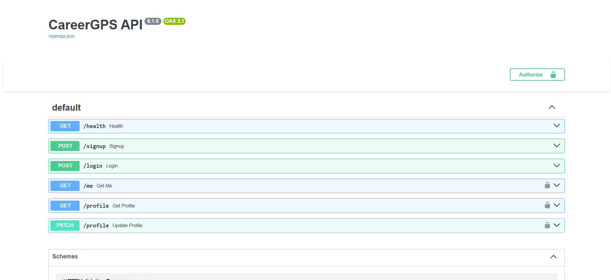

<!-- README refresh -->

# CareerGPS 🚀  
AI-Powered Career Path & Skill Mapping Platform

CareerGPS is an AI-driven platform designed to help students and early-career professionals understand **where they stand**, **what skills they are missing**, and **how to progress toward a desired career path**.

This project focuses on backend engineering, authentication, database design, and scalable system architecture.

---

## 🎯 Problem Statement

Students often struggle to answer:
- What roles fit my current skills?
- What should I learn next?
- How far am I from a specific career path?

CareerGPS addresses this by:
- Collecting user skills and interests
- Mapping them against role requirements
- Providing structured, actionable guidance

---

## 🛠️ Tech Stack

**Backend**
- Python
- FastAPI
- Supabase (PostgreSQL, Authentication, RLS)

**Frontend**
- Next.js
- React
- TypeScript

**Other**
- REST APIs
- JWT-based authentication
- Environment-based configuration

---

## 🧱 System Architecture (High-Level)

```
Frontend (Next.js)
|
| REST API
v
Backend (FastAPI)
|
| Secure DB Access
v
Supabase (PostgreSQL + Auth)
```

---

## 🔐 Authentication & Security

- Supabase email/password authentication
- JWT-based session handling
- Row Level Security (RLS) at the database level
- Backend trusts only authenticated requests

---

## ⚙️ Key Features

- User signup and login
- Skill and interest capture
- Career path recommendations
- Clean backend API structure
- Modular and scalable design

---

## 📸 Project Screenshots

### 🔹 Backend API (FastAPI + Swagger)
Shows the implemented REST API endpoints including authentication and profile management.



---

### 🔹 Frontend (Next.js)
User-facing interface connected to the backend API.


---

### 🔹 Authentication & Users (Supabase)
Live user authentication using Supabase Auth with real users stored securely.


---

## 🧠 What I Learned

- Designing RESTful APIs using FastAPI
- Secure authentication workflows
- PostgreSQL schema design and RLS policies
- Structuring full-stack projects for maintainability
- Translating real-world problems into software systems

---

## 🚧 Project Status

CareerGPS is an **ongoing project**. Planned improvements include:
- Advanced AI-based recommendations
- Skill-gap visualizations
- Resume and learning roadmap generation

---

## ▶️ Getting Started (Development)

This project uses **Next.js** for the frontend.

```bash
npm install
npm run dev
```
Open http://localhost:3000 to view the app.

🔗 Links

Portfolio: https://github.com/alishabukhari

Repository: https://github.com/alishabukhari/CareerGPS

