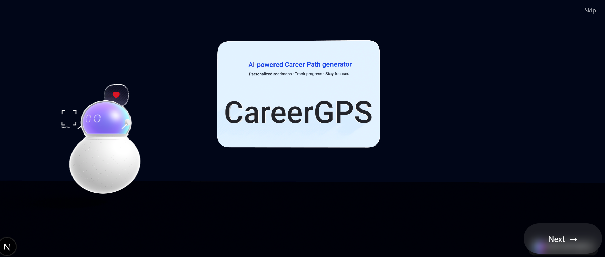
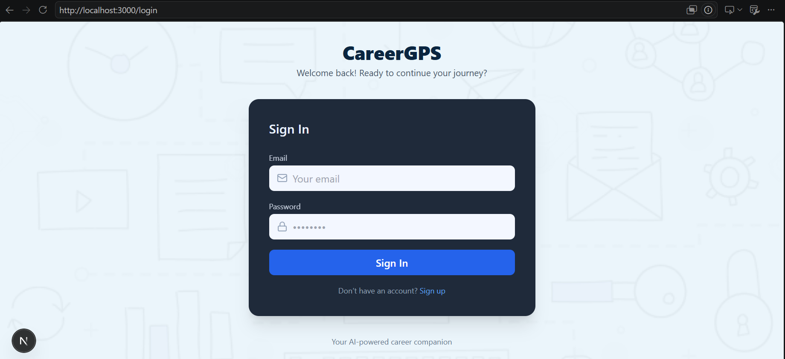
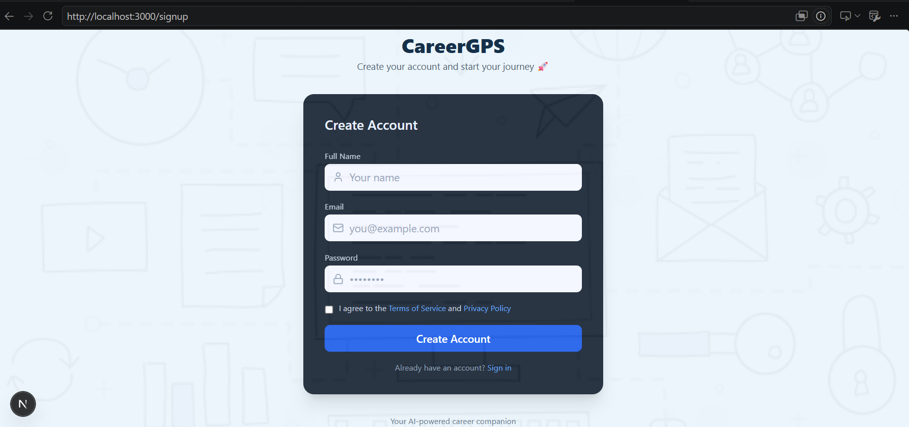
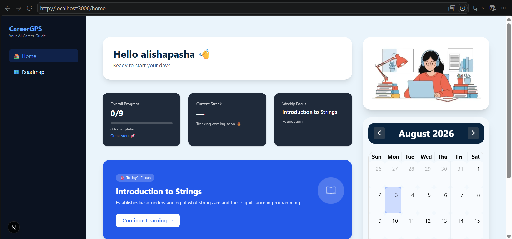
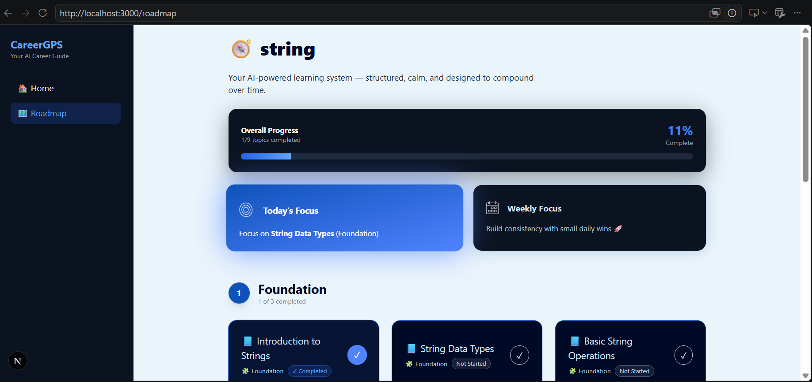
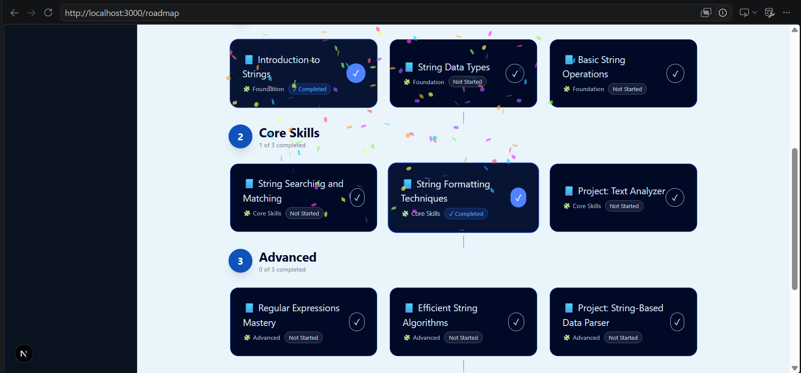

# 🚀 CareerGPS
### AI-Powered Career Roadmap & Personalized Learning Platform

CareerGPS is a full-stack AI-powered learning platform that helps students and aspiring software engineers build personalized learning roadmaps, track progress, and receive AI-assisted guidance throughout their learning journey.

The platform combines **Next.js**, **FastAPI**, **Supabase**, and **OpenAI** to deliver an interactive career planning experience with structured learning paths and intelligent assistance.

---

# ✨ Features

- 🔐 Secure user authentication
- 👤 Personalized user profiles
- 🧠 AI-generated learning roadmaps
- 📚 Foundation → Core Skills → Advanced learning paths
- ✅ Progress tracking
- 📈 Learning statistics dashboard
- 🎯 Daily & Weekly learning focus
- 💬 AI chat assistant *(currently under development)*
- 📡 FastAPI REST API
- 🗄️ Supabase PostgreSQL database
- ⚡ Modern React + Next.js frontend

---

# 📸 Application Preview

## Landing Page



---

## Login



---

## Sign Up



---

## Dashboard

Personalized dashboard showing overall progress, current learning streak, weekly focus, and today's recommended topic.



---

## Personalized Roadmap

AI-generated roadmap divided into Foundation, Core Skills, and Advanced stages.



---

## Progress Tracking

Users can complete topics, unlock new stages, and visualize their learning progress.



---

# 🛠 Tech Stack

## Frontend

- Next.js (App Router)
- React
- TypeScript
- Tailwind CSS
- Framer Motion

## Backend

- FastAPI
- Python
- REST API
- Server-Sent Events (SSE)

## Database & Authentication

- Supabase
- PostgreSQL
- Row Level Security (RLS)
- JWT Authentication

## AI

- OpenAI API
- Streaming AI Responses

---

# 🏗 System Architecture

```text
                    Next.js Frontend
                           │
                    REST API Requests
                           │
                           ▼
                    FastAPI Backend
                           │
      ┌────────────────────┼────────────────────┐
      │                    │                    │
      ▼                    ▼                    ▼
  Supabase DB         OpenAI API         Authentication
(PostgreSQL + RLS)    AI Responses      JWT + Supabase
```

---

# 🔐 Authentication

CareerGPS uses secure authentication powered by Supabase.

Features include:

- Email & Password Authentication
- JWT-based Sessions
- Protected API Routes
- Row-Level Security (RLS)
- Secure Backend Authorization

---

# 📡 Backend API

FastAPI automatically generates interactive API documentation.

Swagger UI

```
http://127.0.0.1:8000/docs
```

OpenAPI Schema

```
http://127.0.0.1:8000/openapi.json
```

Main endpoints include:

### Authentication

- POST `/signup`
- POST `/login`
- GET `/me`

### Profile

- GET `/profile`
- PATCH `/profile`

### Roadmap

- GET `/roadmap`
- GET `/roadmap/topic`
- GET `/roadmap/topic/next`
- GET `/roadmap/completed`
- GET `/roadmap/stats`
- GET `/roadmap/today`
- POST `/roadmap/init`
- POST `/roadmap/complete`

### AI Chat

- POST `/roadmap/topic/ai`
- GET `/roadmap/topic/chat`
- GET `/roadmap/topic/chat/sessions`
- POST `/roadmap/topic/chat/session`
- PUT `/roadmap/topic/chat/session/{session_id}`
- DELETE `/roadmap/topic/chat/session/{session_id}`
- POST `/roadmap/topic/react`

---

# 📂 Project Structure

```
CareerGPS
│
├── frontend
│   ├── app
│   ├── components
│   ├── hooks
│   └── lib
│
├── backend
│   ├── app
│   ├── routers
│   ├── services
│   ├── models
│   └── utils
│
├── docs
│   └── images
│
└── README.md
```

---

# 🚧 Current Status

CareerGPS is actively under development.

### ✅ Completed

- Authentication
- User Profiles
- Dashboard
- AI Roadmap Generation
- Progress Tracking
- REST API
- FastAPI Backend
- Responsive Frontend

### 🔄 In Progress

- AI Chat Assistant
- Chat Memory
- Session Management Improvements
- Better AI Prompt Engineering

### 📌 Planned

- Google Calendar Integration
- Resource Recommendations
- AI Research Agent
- Resume Builder
- Interview Preparation
- Learning Analytics
- Weekly Email Reports

---

# 🚀 Running Locally

## Frontend

```bash
cd frontend
npm install
npm run dev
```

Runs on:

```
http://localhost:3000
```

---

## Backend

```bash
cd backend

.\.venv\Scripts\Activate.ps1

python -m uvicorn app.main:app --reload
```

Runs on:

```
http://127.0.0.1:8000
```

---

# 📖 What I Learned

Through CareerGPS, I gained hands-on experience with:

- Full-stack application development
- FastAPI backend architecture
- Next.js App Router
- React state management
- RESTful API design
- Supabase Authentication & PostgreSQL
- JWT-based authentication
- AI integration with OpenAI
- Building scalable software architecture

---

# 👩‍💻 Author

**Alisha Bukhari**

Computer Engineering Student | Aspiring Software Engineer | AI Enthusiast

GitHub: https://github.com/alishabukhari